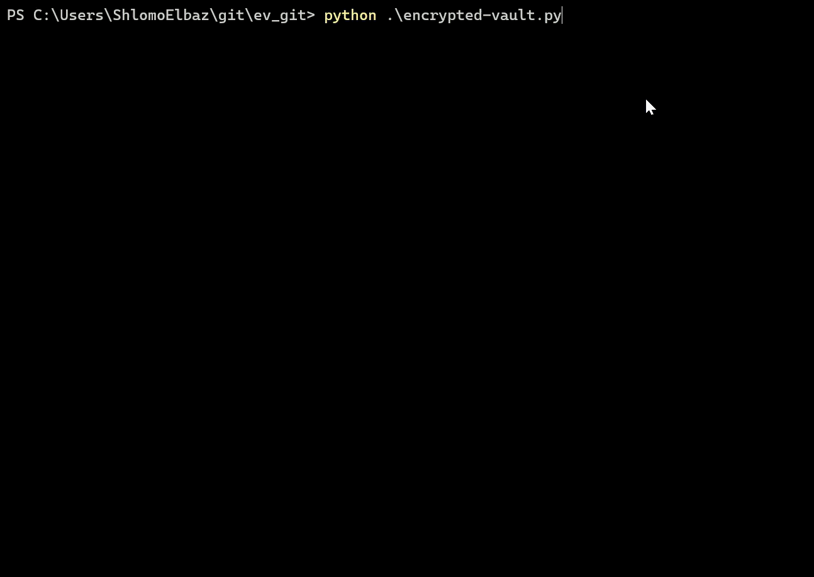
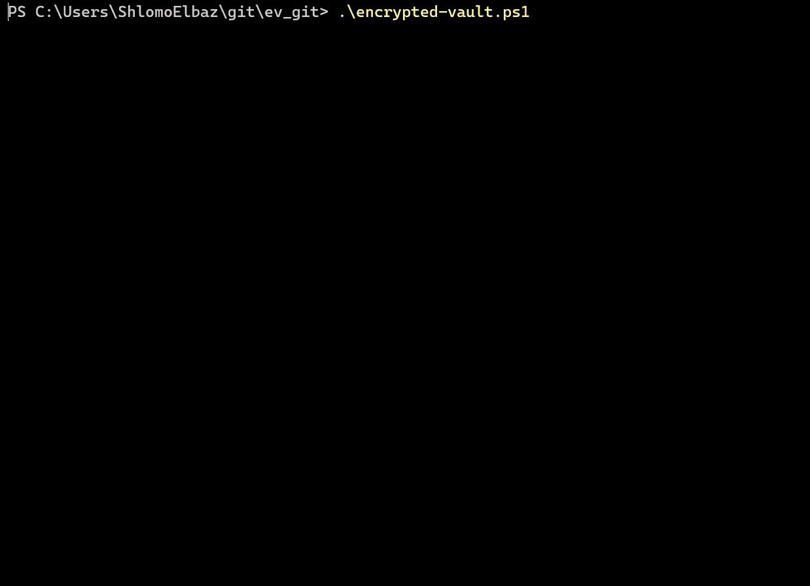

# Encrypted‑Vault 🔐

Encrypted-Vault turns any file into an encrypted **plain‑text** payload (Base64), so it can be transferred via chat or email bodies without sending attachments.     

## What it solves

Many organizations block attachments (PDF/ZIP/EXE, etc.), but allow text in chat and email bodies. This tool outputs a `.txt` file that contains only text, making copy/paste transfer easy.     

## How it works

1. Encrypt a file → get a `.txt` file containing text only.     
2. Transfer the text (copy/paste) through any channel that supports plain text.     
3. Paste the text into a new file (for example `encrypted.txt`) → decrypt → restore the original file.     

## Encrypted file format

The encrypted output is UTF‑8 text with this structure:     

- First line: `NAME:<base64>` (original filename encoded as Base64).     
- Following lines: Base64 payload that includes `salt + ciphertext`.     

Example:
```text
NAME:c2VjcmV0LnBkZg==
<base64 encrypted payload ...>
```
    

## Usage (Python)

### Requirements

- Python 3.x     
- Dependency:
```bash
pip install cryptography
```
    

### Run

```bash
python encrypted-vault.py
```

The Python script is interactive:
- Choose Encrypt or Decrypt.
- Provide a file path or a folder path.
- Choose destination (in‑place or new folder).
- Enter a password.     



## Usage (PowerShell)

```powershell
.\encrypted-vault.ps1
```

The PowerShell script is interactive:
- Choose Encrypt or Decrypt.
- Choose single file or folder mode.
- Choose destination (in‑place or new folder).
- Enter a password.     




## Copy/paste transfer tips

- Copy **all** content including the `NAME:` line.     
- Do not change any characters; even small edits can break decryption.     
- Send the password via a **separate channel** from the encrypted text.     

## Large payloads

For very large encrypted text, paste the content into a paste service or internal secure paste solution, then share the paste reference separately from the password.     

## Security notes (high level)

- Data is GZip‑compressed and then encrypted using AES‑CBC.     
- Key material is derived from the passphrase using PBKDF2 (SHA1) with 200 iterations and a random 16‑byte salt, designed to be compatible between Python and PowerShell.     
- The encrypted text is meaningless without the exact password.     

## Compatibility

Python and PowerShell versions are intended to be format‑compatible (same `NAME:` header concept and protected payload structure).     

### PowerShell vs Python

This project includes two scripts (PowerShell and Python) that produce the same encrypted output format to fit different environments and performance needs.  PowerShell is slower, but it’s available by default on most Windows systems-useful when Python can’t be installed or when working in locked‑down corporate endpoints.  
The Python version is the recommended option for regular use, since it’s typically much faster when encrypting/decrypting many files or large folders while staying compatible with the PowerShell format.
